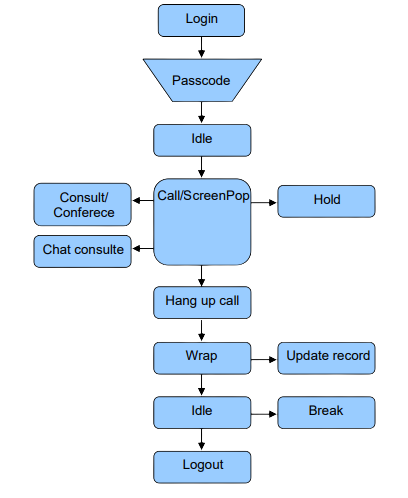

import Image from "next/image";

## Flujo básico de interacciones de voz.

Todas las solicitudes realizadas por el SDK del agente se procesan en el servidor
por el módulo llamado CCM (Campaign Control Module). Por lo tanto, una 
ejecución de un método puede o no ser aceptada por el CCP de forma asíncrona. Siempre
que se ejecuta un método en el WebServices Agent Control, el CCM procesará la solicitud
y enviará un evento de retorno que muestre el resultado del comando.

Los eventos y métodos tienen un ciclo de vida definido, como en el diagrama de flujo siguiente:

