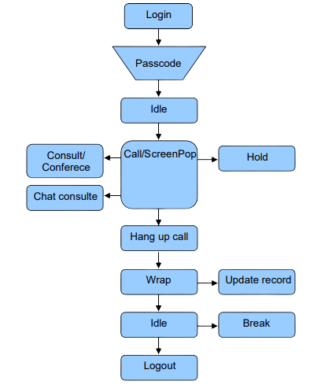

import Image from "next/image";

## Basic Voice Interaction Flow.

All requests made by the Agent SDK are processed on the server by a module called the Campaign Control Module (CCM). Therefore, the execution of a method may or may not be accepted by the CCM asynchronously. Whenever a method is executed in the WebServices Agent Control, the CCM will process the request and send a return event showing the result of the command.

The events and methods have a defined lifecycle, as in the flowchart below:

