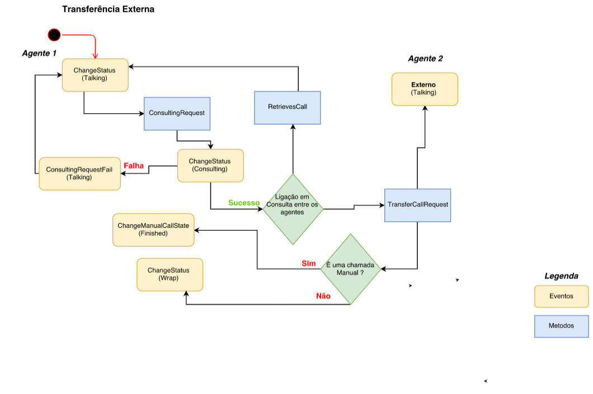

# Transferencias Externas

Las transferencias externas en Olos funcionan en modo ciego o asistido y se pueden realizar para un 
número externo y los eventos y métodos tienen un ciclo de vida definido, como en el siguiente diagrama de flujo:

