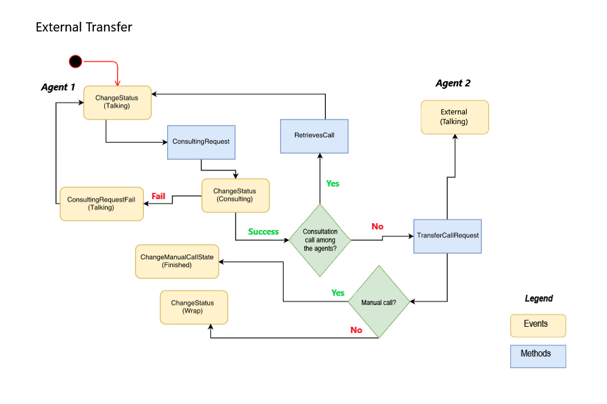

# External Transfers

External transfers in Olos operate in blind or assisted mode and can be carried out to an external number, with events and methods following a defined life cycle, as illustrated in the flowchart below:

