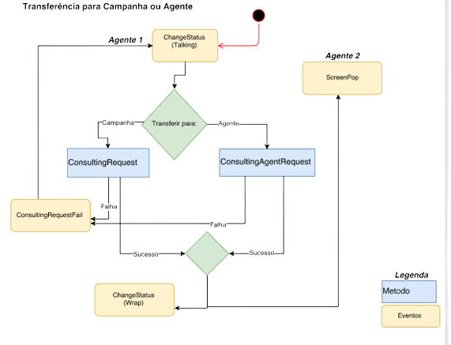

# Transferencias Internas

Las transferencias internas en Olos funcionan en modo ciego o asistido y se pueden realizar para 
los Agentes o para las Campañas, y los eventos y métodos tienen un ciclo de vida definido, como en el siguiente diagrama de flujo:

