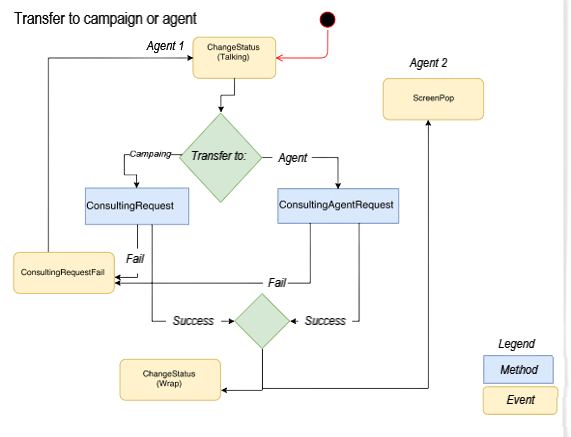

# Internal Transfers

Internal transfers in Olos operate in blind or assisted mode and can be performed for Agents or Campaigns. The events and methods follow a defined life cycle, as illustrated in the flowchart below:

