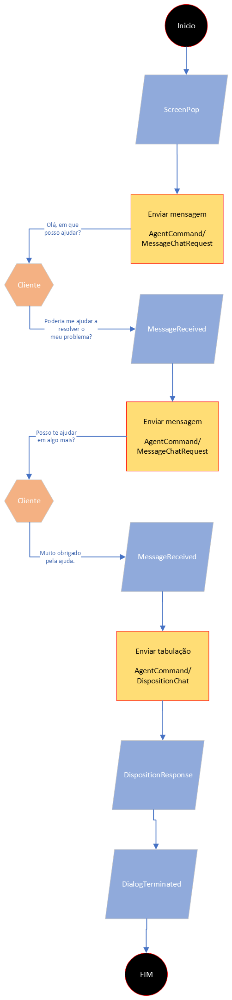

# Básico

### Fluxo de Atendimento - Básico

1. O atendimento é iniciado após o recebimento do evento "Screenpop"
2. O ID do atendimento é representado pelo dialogId
3. Método de envio de mensagem - AgentCommand/MessageChatRequest
4. Evento de recebimento de mensagem - MessageReceived
5. Método que tabula o atendimento - AgentCommand/DispositionChat
6. Evento de retorno da tabulação - DispositionResponse
7. Evento que sinaliza que o chat foi finalizado - DialogTerminated

