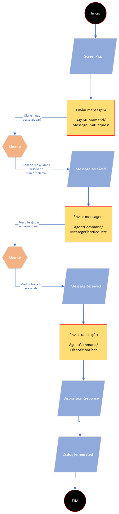

# Basic

### Service Flow - Basic

1. Service starts upon receipt of the "Screenpop" event
2. The service ID is represented by the dialogId
3. Message sending method - AgentCommand/MessageChatRequest
4. Message Receive Event - MessageReceived
5. Method that tabulates the service - AgentCommand/DispositionChat
6. Tab Return Event - DispositionResponse
7. Event that signals that the chat has ended - DialogTerminated

