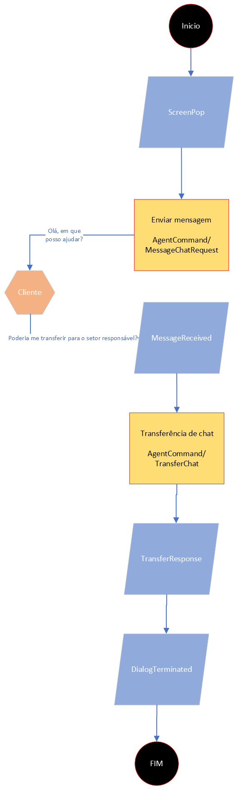

# Transferir

### Flujo del cliente - Transferencia de chat

1. El servicio se inicia al recibir el evento "Screenpop"
2. La identificación del servicio está representada por dialogId
3. Método de mensaje - AgentCommand/MessageChatRequest
4. Evento de recepción de mensajes - MessageReceived
5. Método de transferencia de chat a campaña o agente - AgentCommand/TransferChat
6. Evento de devolución de transferencia - TransferResponse
7. Evento que indica que el chat se finalizó - DialogTerminated

