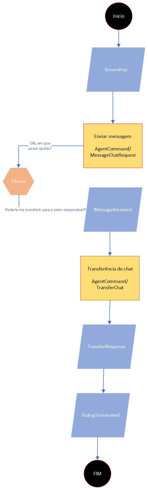

# Basic

### Service Flow - Chat transfer

1. Service starts upon receipt of the "Screenpop" event
2. The service ID is represented by the dialogId
3. Message sending method - AgentCommand/MessageChatRequest
4. Message Receive Event - MessageReceived
5. Chat transfer method for campaign or agent - AgentCommand/TransferChat
6. Transfer return event - TransferResponse
7. Event that signals that the chat has ended - DialogTerminated

