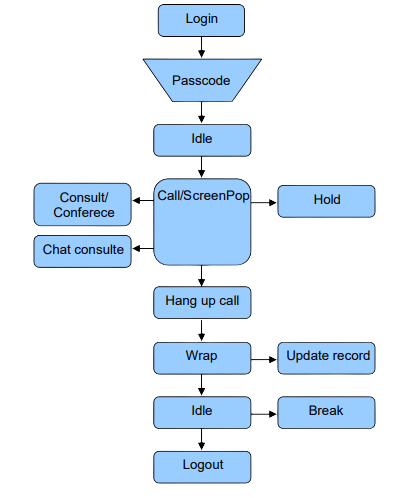

import Image from "next/image";

## Fluxo básico de Interações de Voz.

Todas as requisições realizadas pelo Agent SDK são processadas no
servidor pelo módulo chamado CCM (Campaign Control Module). Portanto, uma
execução de um método pode ou não ser aceita pelo CCM de forma assíncrona. Sempre
que é executado um método no WebServices Agent Control, o CCM processará o pedido
e enviará um evento de retorno mostrando o resultado do comando.

Os eventos e métodos têm um ciclo de vida definido, como no fluxograma abaixo:

