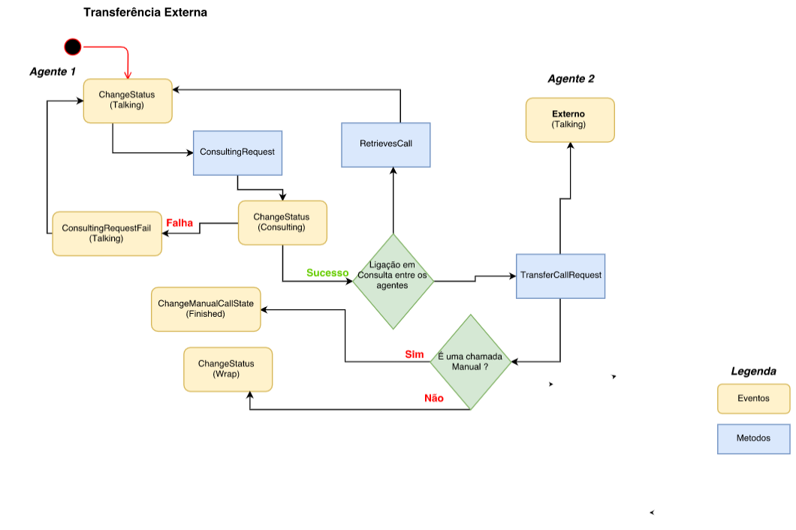

# Transferências Externas

As transferências externas no Olos funcionam no modo cego ou assistido e podem ser realizadas para um
número externo e os eventos e métodos têm um ciclo de vida definido, como no fluxograma abaixo:

